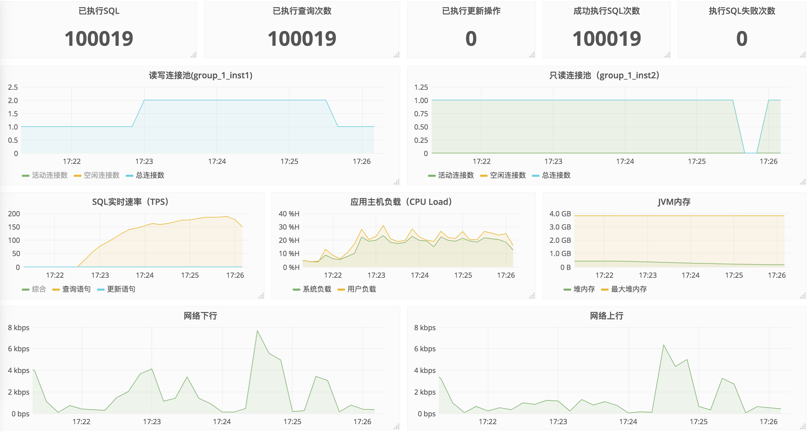
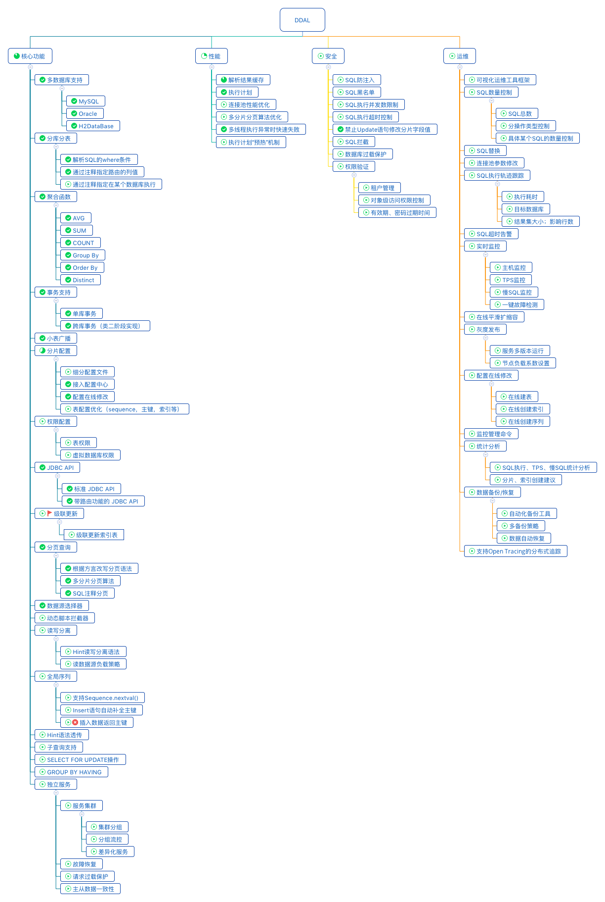

## 简介(Overview)
Raptor-DDAL是使用Java开发的分布式数据库中间件，用于屏蔽底层分库分表的细节，透明化分布式数据的访问。其简单易用的系统配置，智能高效的执行计划，在线平滑的数据伸缩以及完善的运维工具配套等特点，助力企业快速搭建分布式数据存储平台。

## 技术架构(Architecture)

## 特性与约束(Features and Constraints)
### 特性
- 实现JDBC接口，支持[应用集成](http://git.oschina.net/f150/raptor-ddal/blob/develop/doc/ddal-jdbc-document.md)的使用方式
- 实现Server版本，支持[独立代理](http://git.oschina.net/f150/raptor-ddal/blob/develop/doc/ddal-proxy-document.md)的使用方式
- 基于SQL1992标准。支持SQL:1992标准常见DML语法，详见[SQL支持列表](#summary)。
- 支持MySQL、Oracle等常用关系型数据库
- 支持多维度读写分离
- 支持SQL Hint
- 支持分组\聚合\去重语法
- 支持SUM\COUNT\MAX\MIN\AVG等常用函数
- 支持跨库分页
- 支持通过全局表[[注1]](#annotate1)，实现了高效的多表join查询
- 内置多样化的全局序列
- 内置多种分片规则，支持自定义分片规则
- 支持分布式事务。事务日志记录，事务一致性校验，二阶段事务增强实现。
- 支持DDAL进程运行状态监控，包括SQL实时速率、SQL数量统计、SQL执行失败率等指标。
- 引入执行计划及解析结果缓存，提高预编译语句执行效率
- 支持动态虚拟库路由功能
- 支持非分片字段索引
- 支持select xxx.nextval语法及自增字段方式获取序列

## DDAL进程监控
目前监控支持的指标如下：

- SQL数量统计，包括已执行总数，查询数量，更新数量，成功数量和失败数量。
- 连接池状态
- SQL实时速率
- 应用主机负载
- JVM进程内存
- 网络IO
  

### 约束
- 不支持跨库Join

## 开发进度
点击图片查看大图
 ​

## 使用指南(Usage)
[集成模式快速使用指南](./doc/标准输出物/使用手册/快速使用手册-LATEST.md)

[Raptor-ddal SQL92标准开发参考手册](./doc/参考资料/SQL1992/SQL-STD92-DDAL-SUMMARY.pdf)

## 性能测试(Performance Testing)
[性能测试报告](http://git.oschina.net/f150/raptor-ddal/wikis/8.%E6%80%A7%E8%83%BD%E6%B5%8B%E8%AF%95)

## 贡献者(Committers)

* 时邵猛 shishaomeng@gmail.com
* 蔡为铭 sam.iagd@hotmail.com
* 吴昌亮 charleywu@aliyun.com
* 曹海峰 caohaifeng0000@gmail.com

----
[注1]小表全分片冗余即全局表，分片表关联数据需在同一分片，通过这种方式实现了多表join。
