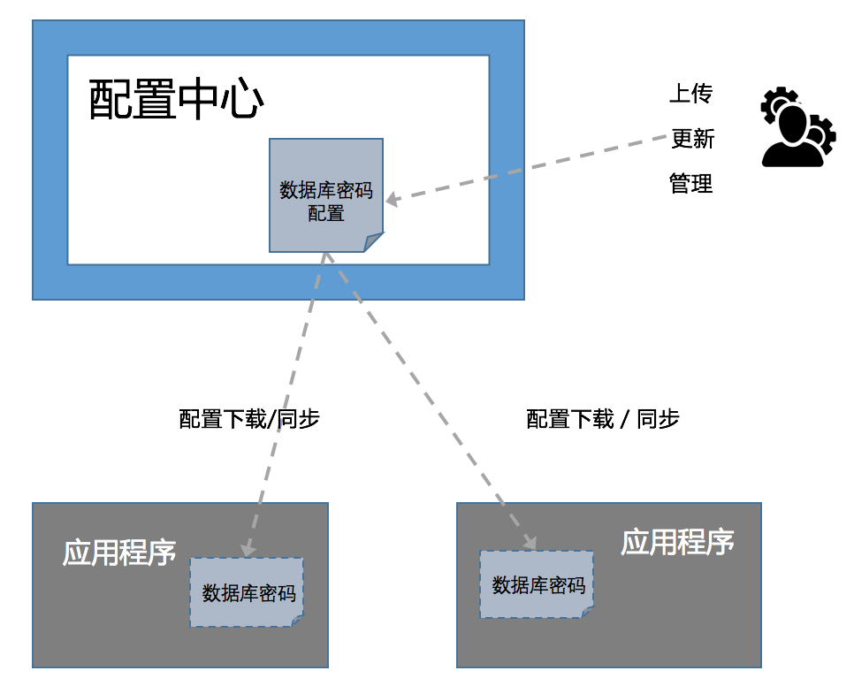

统一配置中心包含服务端和客户端。服务端独立部署，由配置管理员管理。应用程序集成客户端，可以从远程配置中心下载和同步配置。

以数据库密码为例，应用程序从配置中心获取的密码配置副本。

若多个应用程序连接同一个配置中心，那么可以认为每个应用程序的配置副本都是相同的，并且配置中心上任何的修改都会同步更新所有副本。

整体架构图如下：

集成了配置中心客户端的应用程序可在程序启动时下载配置，也可以实时同步key-value形式的properties配置。

修改数据库密码的操作分为以下几步：

1. 管理员修改配置中心的数据库密码。
2. 应用程序通过重启更新本地的远程配置副本。