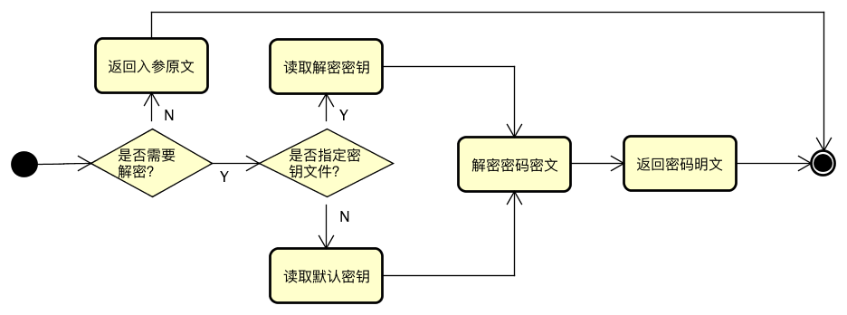

### 加密算法

DDAL使用非对称加密算法，默认私钥长度是2048。使用者可以根据实际情况，自行调整长度，并生成自己的私钥和公钥。

通常情况，RSA使用公钥加密，私钥解密。DDAL的使用方式刚好相反，采取私钥加密公钥解密。原因是在项目中采取公布公钥和密文，可以有效限制私钥和明文的肆意传播。所以，私钥和明文请妥善保管。

### 配置说明

````properties
# 是否对数据源密码进行解密
config.decrypt=true
# 解密密钥文件
config.decrypt.key.file=/home/raptor/.raptor_ddal/decrypt.key
````

- 项目开发初期，为了减少负担，config.decrypt开关在开发阶段可以设置成false，对应的数据库密码需使用明文。
- config.decrypt.key.file是解密密钥文件，文件中保存RSA的公钥。**如果此属性不配置，DDAL会尝试加载默认的解密密钥，默认的解密密钥文件是%user.dir%/.raptor_ddal/decrypt.key**

### 解密流程



### 生成密钥对

````java
@Test
public void testGenKeyPair() throws NoSuchAlgorithmException {
  String[] keyPairs = ConfigTools.genKeyPair(2048);
  System.out.println("PrivateKey:" + keyPairs[0]);
  System.out.println("PublicKey:" + keyPairs[1]);
}
````

生成的密钥需要管理员自己保存，用于生成数据库密码的密文。而公钥配置在应用的配置文件中即可。

注：2048是密钥的长度，长度是768的密钥加密的密文的破解复杂度已极高，所以2048可以任务是绝对安全的。

### 加密明文

````java
@Test
public void testGenPassword() throws Exception {
  System.out.println(ConfigTools.encrypt(privateKeyText, "sa"));
}
````