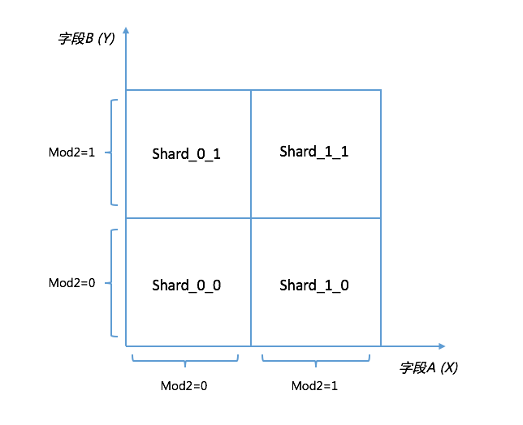
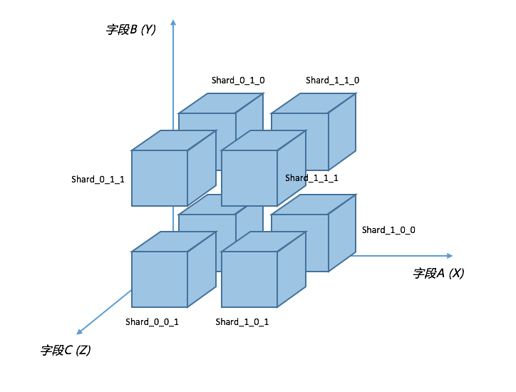

## 多维分片理论支撑与设计

应用存在使用多个字段进行分片的场景，DDAL目前最多支撑到三维；二维分片以平面坐标系作为理论支撑，三维分片以空间坐标系作为理论支撑；再高维度的分片计算极为复杂，且很难抽象，故暂不支持；

### 二维分片

**理论模型**

假设有表Table，分片字段为A，B，且分片算法都是Mod2；字段A分布在坐标系X轴上，字段B分布在坐标系Y轴上；则分片及数据分布如下：

**数据推导**

**执行分片分布示例**

二维分片可以抽象成二维数组，A、B字段计算出的路由结果组成坐标如：[0, 1]

*场景1：无条件查询*

> 示例语句: SELECT * FROM TABLE;
>
> 分片结果：Shard\_0\_0, Shard\_0\_1, Shard\_1\_0, Shard\_1\_1

*场景2：A分片字段带Mod=0条件*

> 示例语句：SELECT * FROM TABLE WHERE A=0;
>
> 分片结果：Shard\_0\_0, Shard\_0\_1

*场景3：A分片字段带Mod=1条件*

> 示例语句：SELECT * FROM TABLE WHERE A=1;
>
> 分片结果：Shard\_1\_0, Shard\_1\_1

*场景4：B分片字段带Mod=0条件*

> 示例语句：SELECT * FROM TABLE WHERE B=0;
>
> 分片结果：Shard\_0\_0, Shard\_1\_0

*场景5：B分片字段带Mod=1条件*

> 示例语句：SELECT * FROM TABLE WHERE B=1;
>
> 分片结果：Shard\_0\_1, Shard\_1\_1

*场景6：A分片字段带Mod=0条件，B分片字段带Mod=1条件*

> 示例语句：SELECT * FROM TABLE WHERE A=0 AND B=1;
>
> 分片结果：Shard\_0\_1

### 三维分片

**理论模型**

假设有表Table，分片字段为A，B，C，且分片算法都是Mod2；字段A分布在坐标系X轴上，字段B分布在坐标系Y轴上，字段C分布在坐标系Z轴上；则分片及数据分布如下：

**执行分片分布示例**

三维分片可以抽象成三维数组，A、B、C字段计算出的路由结果组成坐标如：[0, 1, 0]

*场景1：无条件查询*

> 示例语句: SELECT * FROM TABLE;
>
> 分片结果：Shard\_0\_0\_0, Shard\_0\_0\_1, Shard\_0\_1\_0, Shard\_0\_1\_1, Shard\_1\_0\_0, Shard\_1\_0\_1, Shard\_1\_1\_0, Shard\_1\_1\_1

*场景2：A分片字段带Mod=0条件*

> 示例语句：SELECT * FROM TABLE WHERE A=0;
>
> 分片结果：Shard\_0\_0\_0, Shard\_0\_0\_1, Shard\_0\_1\_0, Shard\_0\_1\_1

*场景3：B分片字段带Mod=0条件*

> 示例语句：SELECT * FROM TABLE WHERE B=0;
>
> 分片结果：Shard\_0\_0\_0, Shard\_0\_0\_1, Shard\_1\_0\_0, Shard\_1\_0\_1

*场景4：C分片字段带Mod=0条件*

> 示例语句：SELECT * FROM TABLE WHERE C=0;
>
> 分片结果：Shard\_0\_0\_0, Shard\_0\_1\_0, Shard\_1\_0\_0, Shard\_1\_1\_0

*场景5：A分片字段带Mod=0条件，B分片字段带Mod=0条件*

> 示例语句：SELECT * FROM TABLE WHERE A=0 AND B=0;
>
> 分片结果：Shard\_0\_0\_0, Shard\_0\_0\_1

*场景6：A分片字段带Mod=0条件，B分片字段带Mod=0条件，C分片字段带Mod=0条件*

> 示例语句：SELECT * FROM TABLE WHERE A=0 AND B=0 AND C=0;
>
> 分片结果：Shard\_0\_0\_0

