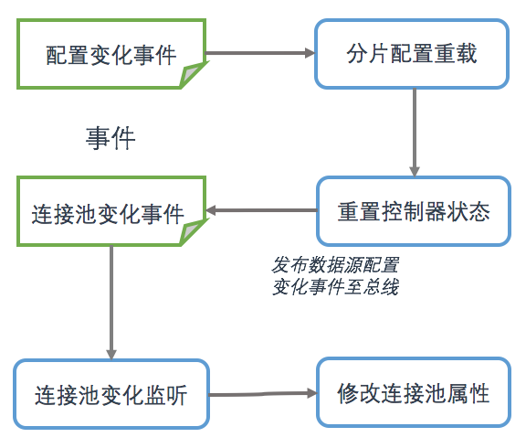

一个足够稳定的应用往往都有在线重载配置的需求，即在不重启的情况下重新加载被修改的配置文件，所以应用程序需要具备自动侦听配置文件变化的能力。

目前，DDAL支持文件和配置中心两种配置源，所以DDAL不仅需要支持基于文件的自动重载，还需支持其他的配置源，比如配置中心或JMX。

**分片配置以及初始化过程**：

1. 加载分片配置，配置数据来源是本地文件或者远程配置中心。
2. 注册重载事件监听 `ReloadingEventListener` 
3. 注册文件变化重载控制器 PeriodicReloadingTrigger。

**重载事件监听器**

重载事件监听器收到本地配置文件变化事件 `LocalShardConfigChangeEvent` 之后，首先对分片配置进行重新加载，然后重置ReloadingController的重载状态，最后向事件中心发布数据源变化事件。事件主线使用Guava的EventBus实现。

 

重载事件监听器发布的数据源变化事件会被数据源变化监听器捕捉，从而对连接池的属性进行修改。